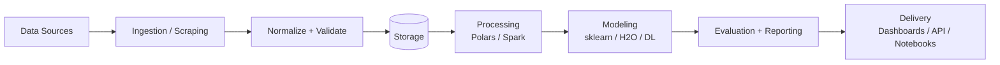

<!-- (Opcional) Banner: subí una imagen a assets/banner.png y descomentá la línea -->
<!--  -->

# Paulina Peralta (@PaulinaIA)

AI & Data Science • Electronic Engineer • Barcelona  
Building **end-to-end ML systems** and exploring **Generative AI for scientific simulation** (Diffusion / DiT)

[LinkedIn](https://www.linkedin.com/in/paulina-peralta-916a46140/) ·
[Email](mailto:pauliperalta@gmail.com) ·
[GitHub](https://github.com/PaulinaIA)

---

## About
I’m an Electronic Engineer focused on **Applied ML + Data Engineering**, and I’m especially interested in **Generative AI for scientific simulation** (diffusion/transformer-based models).  
I care a lot about **clean repo structure**, **reproducibility**, and building projects that feel *real* (not just notebooks).

---

## What I’m focused on now
- **Generative models for simulation** (Diffusion / DiT) and high-dimensional generation  
- **ML systems**: scraping → storage → processing (Polars/Spark) → modeling → evaluation  
- **Production mindset**: modular codebases, documentation-first, scalable pipelines  

---

## My pipeline mindset

## Featured projects (my current favorites)

### 🌸 Bloom — Adaptive fertility prediction (ML + personalization)
A cycle prediction system that combines ML + personalized signals to estimate cycle length and ovulation timing.
- Clean modular design (feature engineering + predictors + evaluation)
- Emphasis on interpretability and practical use
flowchart LR
  X[(User Logs)] --> FE[Feature Engineering]
  FE --> M1[Cycle Predictor]
  FE --> M2[Ovulation Classifier]
  M1 --> OUT[Predictions + Insights]
  M2 --> OUT
Repo: https://github.com/PaulinaIA/Bloom

### 🛡️ Dark Eye Core — Threat Intelligence ETL + dashboards
Pipeline that extracts and normalizes IoCs from multiple sources and visualizes them in Grafana.
- Multi-source ingestion (AbuseIPDB / URLhaus / OTX)
- Normalization + relational storage + observability-ready design
flowchart LR
  S1[AbuseIPDB] --> N[Normalizers]
  S2[URLhaus] --> N
  S3[AlienVault OTX] --> N
  N --> DB[(PostgreSQL)]
  DB --> G[Grafana Dashboards]
Repo: https://github.com/PaulinaIA/dark_eye_core

### 🤖 Moltbook Safety — Web scraping + behavioral signals → karma prediction
End-to-end data engineering + applied ML project.
- Web scraping → relational model → processing with Polars/Spark → modeling (H2O AutoML)
- Focus on content/behavior features and responsible analysis
flowchart LR
  W[Web Scraping] --> R[(Relational Tables)]
  R --> P[Processing Polars / Spark]
  P --> FS[Feature Set]
  FS --> ML[Modeling H2O AutoML]
  ML --> EV[Metrics + Insights]  
Repo: https://github.com/PaulinaIA/moltbook-safety

---

## Tech stack (curated)
**Python · SQL · Spark · Polars · Airflow · Docker · AWS · scikit-learn · PyTorch · TensorFlow**  
Also: R · MATLAB · C/C++ · Embedded/IoT background

---

## How I work
- I care about **clarity** (simple architecture, readable code)
- I prioritize **reproducibility** (structured repos, deterministic pipelines when possible)
- I like projects with **meaning + impact**, not only metrics

---

## Contact
📩 pauliperalta@gmail.com  
🔗 https://www.linkedin.com/in/paulina-peralta-916a46140/

