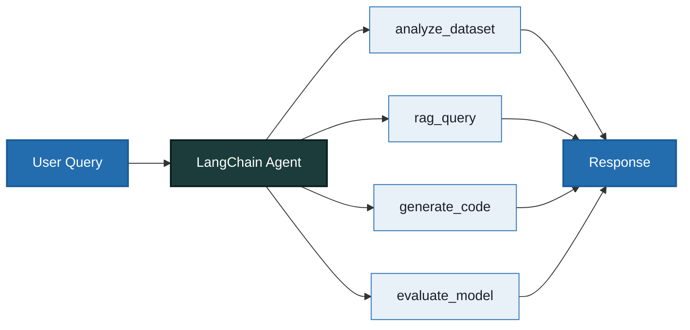
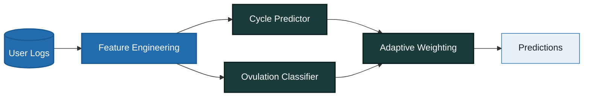
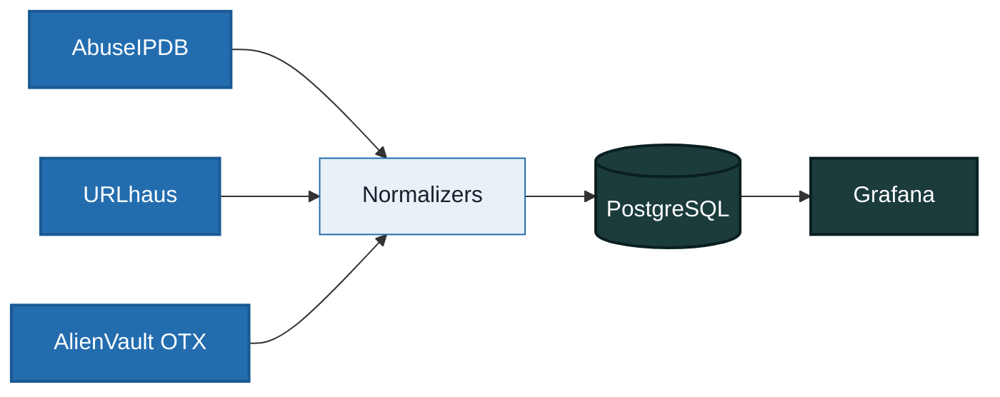

# Paulina Peralta

Data Scientist · AI Engineer · Data Engineer  
Barcelona — open to remote (LATAM / EU)

[LinkedIn](https://www.linkedin.com/in/paulina-peralta-916a46140/)
&nbsp;·&nbsp;
[Email](mailto:pauliperalta97@gmail.com)
&nbsp;·&nbsp;
[GitHub](https://github.com/PaulinaIA)

 

---

## About

Electronic Engineer completing a Master's in Data Science at La Salle — Universitat Ramon Llull, Barcelona. I build end-to-end machine learning systems and data pipelines, and in parallel my Master's thesis investigates diffusion-based generative models as fast surrogate simulators for the LHCb electromagnetic calorimeter.

Before moving to Barcelona I worked as a data analyst in the IP core team at Tigo Paraguay, where I built ETL pipelines and reporting over network traffic data. I care about clean architecture, reproducibility, and systems that solve real problems beyond notebooks.

---

## Research

### LHCbCaloFlow — Generative Models for Fast Calorimeter Simulation
*Master's thesis · La Salle, Universitat Ramon Llull*

Geant4 is the gold-standard simulator for particle-physics detectors, but it is computationally prohibitive: a single electromagnetic shower takes minutes of CPU, while experiments like LHCb need on the order of 10⁹ simulated events. My thesis investigates generative models as surrogate simulators for the LHCb electromagnetic calorimeter, aiming for orders-of-magnitude speedups while preserving the physics distributions that downstream analyses depend on.

The work adapts diffusion transformer (DiT) architectures to the LHCb ECAL geometry — Inner, Middle and Outer regions with their Shashlik design — compares two diffusion frameworks (Elucidating Diffusion Models and Rectified Flow), and develops a physics-aware evaluation methodology built on shower shape and energy response metrics.

Implementation: [FastCaloDit](https://github.com/PaulinaIA/FastCaloDit)

---

## Projects

### forge-ai — LLM Agent for ML Workflows

An LLM-powered assistant that guides ML practitioners through the full lifecycle — data analysis, code generation, and model evaluation. Built with LangChain agents that combine tool-calling (dataset profiling, preprocessing suggestions, pipeline generation) with RAG over ML documentation, powered by free-tier APIs (Groq, Gemini) through the OpenAI-compatible SDK. ChromaDB handles the vector store and Streamlit exposes a conversational UI.

```mermaid
flowchart LR
    U[User Query] --> A[LangChain Agent]
    A --> T1[analyze_dataset]
    A --> T2[rag_query]
    A --> T3[generate_code]
    A --> T4[evaluate_model]
    T1 --> R[Response]
    T2 --> R
    T3 --> R
    T4 --> R

    classDef io fill:#236DAF,stroke:#1a5a94,color:#fff,stroke-width:2px
    classDef core fill:#1C3C3C,stroke:#0a1f1f,color:#fff,stroke-width:2px
    classDef tool fill:#E8F0F8,stroke:#236DAF,color:#1a202c,stroke-width:1px
    class U,R io
    class A core
    class T1,T2,T3,T4 tool
```

Stack &nbsp;·&nbsp; `LangChain` `ChromaDB` `Streamlit` `Groq` `Gemini` `OpenAI SDK`  
Repo &nbsp;·&nbsp; [forge-ai](https://github.com/PaulinaIA/forge-ai)

---

### moltbook-safety — End-to-End ETL and AutoML Pipeline

A full-stack data engineering and machine learning project that scrapes a social network of AI agents, processes the data through a medallion architecture, and trains a karma prediction model with H2O AutoML. The pipeline handles 154,286 records across 11,273 users, 18,247 posts and 121,728 comments; the final stacked ensemble reaches R²(log)=0.74 on log-transformed karma. The local version runs on Polars and PostgreSQL; the cloud version runs on AWS, with Glue orchestrating the ETL and SageMaker training the model.

```mermaid
flowchart LR
    W[Web Scraping] --> B[(Bronze)]
    B --> S[Silver]
    S --> G[Gold]
    G --> M[H2O AutoML]
    M --> E[Predictions]

    classDef source fill:#236DAF,stroke:#1a5a94,color:#fff,stroke-width:2px
    classDef bronze fill:#cd7f32,stroke:#8b5a2b,color:#fff,stroke-width:2px
    classDef silver fill:#c0c0c0,stroke:#808080,color:#1a202c,stroke-width:2px
    classDef gold fill:#d4af37,stroke:#8b7318,color:#1a202c,stroke-width:2px
    classDef model fill:#1C3C3C,stroke:#0a1f1f,color:#fff,stroke-width:2px
    class W source
    class B bronze
    class S silver
    class G gold
    class M,E model
```

Stack &nbsp;·&nbsp; `Python` `Polars` `PostgreSQL` `Playwright` `H2O AutoML` `AWS (S3, RDS, Glue, SageMaker)`  
Repo &nbsp;·&nbsp; [moltbook-safety](https://github.com/PaulinaIA/moltbook-safety)

---

### Bloom — Adaptive Fertility Prediction

A machine learning system for menstrual cycle length and ovulation timing prediction. The interesting design choice is the adaptive weighting between models based on each user's regularity: users with stable cycles lean on regression, while irregular users rely more heavily on anomaly-aware ensembles. On the Marquette dataset (1,510 cycles, 157 users) the cycle length predictor reaches RMSE 1.148 days and R²=0.9038, and the ovulation classifier hits 73.35% accuracy within a two-day window.

```mermaid
flowchart LR
    L[(User Logs)] --> FE[Feature Engineering]
    FE --> M1[Cycle Predictor]
    FE --> M2[Ovulation Classifier]
    M1 --> A[Adaptive Weighting]
    M2 --> A
    A --> OUT[Predictions]

    classDef data fill:#236DAF,stroke:#1a5a94,color:#fff,stroke-width:2px
    classDef model fill:#1C3C3C,stroke:#0a1f1f,color:#fff,stroke-width:2px
    classDef output fill:#E8F0F8,stroke:#236DAF,color:#1a202c,stroke-width:1px
    class L,FE data
    class M1,M2,A model
    class OUT output
```

Stack &nbsp;·&nbsp; `Python` `scikit-learn` `RandomForest` `GradientBoosting` `pandas`  
Repo &nbsp;·&nbsp; [Bloom](https://github.com/PaulinaIA/Bloom)

---

### Crypto-ML-Predictor — Trading Signal Classifier

Multi-class Buy/Sell/Hold classifier on Bitcoin historical data. I engineered fifteen technical indicators (RSI, MACD, Bollinger Bands, ATR, EMA, ADX, Williams %R, MFI, ROC) and trained an XGBoost classifier with Bayesian hyperparameter optimization through Optuna, using SMOTE to compensate for the class imbalance between hold and action signals. The model reaches around 74% accuracy and a one-vs-rest ROC-AUC of roughly 0.88.

```mermaid
flowchart LR
    BTC[Bitcoin OHLCV] --> TA[Technical Indicators]
    TA --> SM[SMOTE]
    SM --> XGB[XGBoost + Optuna]
    XGB --> P[Buy / Sell / Hold]

    classDef data fill:#236DAF,stroke:#1a5a94,color:#fff,stroke-width:2px
    classDef process fill:#E8F0F8,stroke:#236DAF,color:#1a202c,stroke-width:1px
    classDef model fill:#1C3C3C,stroke:#0a1f1f,color:#fff,stroke-width:2px
    class BTC data
    class TA,SM process
    class XGB,P model
```

Stack &nbsp;·&nbsp; `XGBoost` `Optuna` `imbalanced-learn` `pandas` `scikit-learn`  
Repo &nbsp;·&nbsp; [Crypto-ML-Predictor](https://github.com/PaulinaIA/Crypto-ML-Predictor)

---

### dark_eye_core — Threat Intelligence ETL

An ingestion and correlation pipeline for indicators of compromise, pulling from three threat intelligence feeds (AbuseIPDB, URLhaus, AlienVault OTX) and merging them into a unified PostgreSQL schema with cross-source correlation tables. Grafana dashboards surface the data for operational monitoring; the whole stack runs on Docker Compose with Airflow handling orchestration.

```mermaid
flowchart LR
    S1[AbuseIPDB] --> N[Normalizers]
    S2[URLhaus] --> N
    S3[AlienVault OTX] --> N
    N --> DB[(PostgreSQL)]
    DB --> GR[Grafana]

    classDef source fill:#236DAF,stroke:#1a5a94,color:#fff,stroke-width:2px
    classDef process fill:#E8F0F8,stroke:#236DAF,color:#1a202c,stroke-width:1px
    classDef storage fill:#1C3C3C,stroke:#0a1f1f,color:#fff,stroke-width:2px
    class S1,S2,S3 source
    class N process
    class DB,GR storage
```

Stack &nbsp;·&nbsp; `Python` `PostgreSQL` `Airflow` `Docker Compose` `Grafana` `psycopg3`  
Repo &nbsp;·&nbsp; [dark_eye_core](https://github.com/PaulinaIA/dark_eye_core)

---

### Reconocimiento-de-emociones — ViT + LightGBM

A hybrid approach to facial emotion classification that uses a pretrained ViT-B/16 to extract 768-dimensional embeddings, then feeds them into an Optuna-tuned LightGBM classifier over six emotion classes. On a 15,453-image dataset the system reaches 74.26% validation accuracy, and half of the LightGBM feature importance concentrates in just 257 of the 768 embedding dimensions — a useful observation when thinking about compression or distillation. Academic project at La Salle, joint work with four other students.

```mermaid
flowchart LR
    I[Facial Image] --> V[ViT-B/16]
    V --> E[768-dim Embeddings]
    E --> L[LightGBM + Optuna]
    L --> C[6 Emotion Classes]

    classDef input fill:#236DAF,stroke:#1a5a94,color:#fff,stroke-width:2px
    classDef model fill:#1C3C3C,stroke:#0a1f1f,color:#fff,stroke-width:2px
    classDef feat fill:#E8F0F8,stroke:#236DAF,color:#1a202c,stroke-width:1px
    class I input
    class V,L model
    class E,C feat
```

Stack &nbsp;·&nbsp; `PyTorch` `timm` `LightGBM` `Optuna` `scikit-learn`  
Repo &nbsp;·&nbsp; [Reconocimiento-de-emociones-Vit-LightGBM-Optuna](https://github.com/PaulinaIA/Reconocimiento-de-emociones-Vit-LightGBM-Optuna)

---

## Tech Stack

Languages &nbsp;·&nbsp; `Python` `SQL` `R` `MATLAB` `C/C++`  
ML / AI &nbsp;·&nbsp; `scikit-learn` `XGBoost` `LightGBM` `H2O AutoML` `PyTorch` `TensorFlow` `Optuna` `LangChain`  
Data Engineering &nbsp;·&nbsp; `Polars` `Airflow` `PostgreSQL` `Docker` `AWS (S3, RDS, Glue, SageMaker, CloudWatch)` `Grafana`  
Background &nbsp;·&nbsp; Electronic Engineering · Embedded / IoT · Scientific Computing

---

&nbsp;

---

pauliperalta97@gmail.com &nbsp;·&nbsp; [linkedin.com/in/paulina-peralta](https://www.linkedin.com/in/paulina-peralta-916a46140/)

